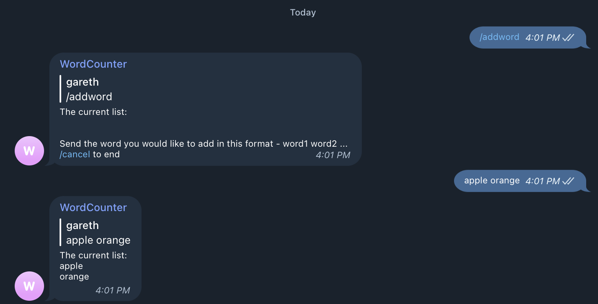

# Word Counter Telegram Bot
A telegram bot that allows users to set specific words and count the instances of each group member saying any of the words. [python-telegram-bot](https://docs.python-telegram-bot.org/en/stable/index.html#) and [Supabase](https://supabase.com/) used.

## Usage
Add words that the users would like to count by running `/addword`. Send the words with a space as a delimiter. `/cancel` is used to cancel the interaction with the bot.


Messages are recorded and if the text matches any word in the list the bot will be triggered. Running `/score` allows users to check a tallied count for each member.


## Process
### 1. Create a bot with [BotFather](https://t.me/botfather)
### 2. Create a `keys.py` file and store the API key 
```python 
key = "API KEY"
```
### 3. Create a supabase project and store the API url and key in `keys.py`
```python 
SUPABASE_URL = "SUPABASE_URL"
SUPABASE_KEY = "SUPABASE_KEY"
```
### 4. Create the tables


### 5. Create the view
```sql
create view score as
select username, SUM(count) as total_count from records
group by username
order by total_count desc
```


